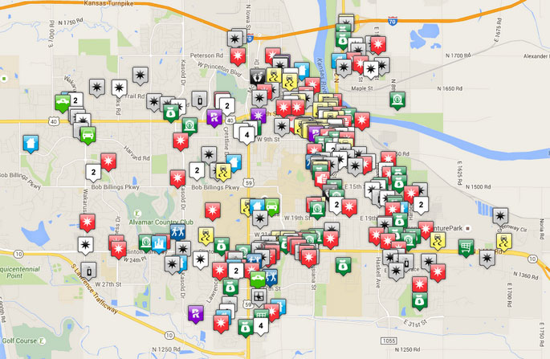
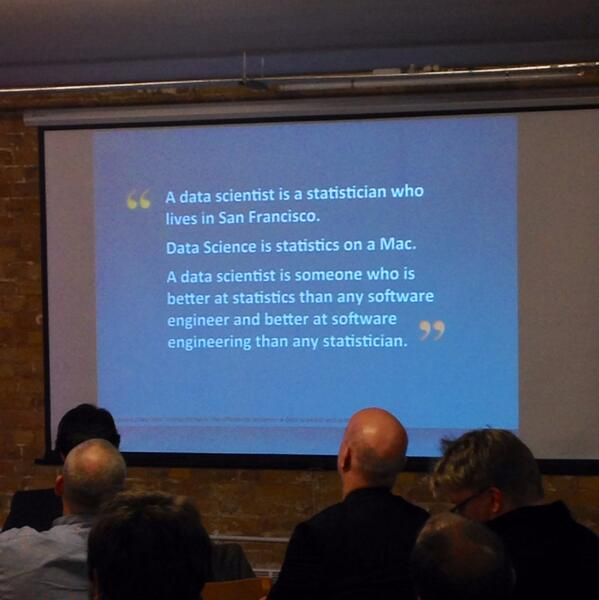

# Learning Goals

* Understand the challenges of building AI-enabled systems
* Understand the key differences between traditional software and
  AI-enabled systems

---
# Traditional Software vs AI

----
## Dealing with Complexity in Software

* Information hiding & encapsulation: Hide design decisions & enforce
  strict boundaries
* Reuse: Provide reusable libraries & APIs with a well-defined contract
* Composition: Build large components out of smaller ones
* Q. Are these still applicable to AI-enabled systems?

---
# Development Challenges

----
## Specification

* No clear definition of "correct" behavior
	* (Always true to some extent, but more pervasive in AI)
* Optimizing metrics instead of correctness
* Example: Viewer satisfaction in streaming apps
* Q. Other examples?

----
## Specification Continued

* Design by contract: Pre- & post-conditions, invariants
  * Post guaranteed as long as pre satisifed by client
  * Invariant: A statement assumed to be true throughout execution
	* e.g., "A set never contains duplicate elements''
* Similar notions in ML models?

----
## Deductive vs Inductive Method

* Traditional software: Encode an application logic as a
  sequence of well-defined statements
* In ML:
  * Build an initial hypothesis (model) & evaluate on test data
  * If results unsatisfactory, improve the model & repeat
  * Not too far from what scientists do!

----
## Implementation

* Behavior is in the data, not in the code
* Data collection & labeling
  * Lack of representative data: Imbalanced training set
  * Scarcity of labelled data: Where to obtain ground truth?
	* Example: Anti-spam detector 

----
## Implementation Continued

* Feature engineering
  * Extracting useful features from raw data 
  * Often considered "black art"; requires in-depth domain knowledge
* Configuration
  * Hyperparameters
  * Again, usually obtained through experiments
  * Must be versioned for reproducibility 

----
## Testng and Debugging

* Traditional techniques: Unit testing, fault localization, breakpoints...
  * No longer applicable!
* Lack of transparency & interpretability
  * Why did the model make this decision?
* Can test the model, but how do we evaluate the quality of data?

---
# Deployment Challenges

----
## Data Drifts

* ML estimates f(x) = y
  * What if the relationship between x & y changes over time? 
* A common problem in ML-driven systems
* Example: Model of customer purchase behavior
  * May change over time depending on the strength of the economy 
* In general, impossible to predict; requires continuous monitoring &
  model update

----
## Feedback loops

* System is deployed as part of an environment
* Output influences the environment
  * In turn, affects input back to the system
  * Over time, may lead to undesirable (and difficult to reverse) outcome
  * In AI, esp. true if initial model is biased

[Need a better diagram]

----
## Example: Crime Predicition

* Use past data to predict crime rates 
* Police increases the frequency of patrol in area X
* More arrested made in area X
* New crime data fed back to the model
* Repeat

----
## Adversarial Environment

* Some agents may try to game the system

* [TBD]

----
## Dependency Management

* Dependencies on:
  * features
  * data sets
  * configuration parameters
  * hardware resources & software packages
* CACE: Changing Anything Changes Everything
  * Difficult to reproduce results
  * Even more difficult to reuse models 
* Version control & data management tools; still in infancy

----
## Exercise: University Rankings

* Discuss potential challenges with:
  * Specification?
  * Data collection? Feature selection?
  * Data drifts?
  * Feedback loops?
  

---
# Organizational Challenges

Don't ignore human factors!

----
## Data Scientists & Engineers

----
## Data Scientists & Engineers: Caricatures

* Data scientists
  * Model development & evaluation
  * Main tools: R, MATLAB, Jupyter Notebook
  * May be new to SE concepts (version control, CI...)
* Engineers
  * Infrastructure, tools, processes
  * Deployment & maintenance pipeline
  * Models as a blackbox
* Tensions sometime exist!

---
# Summary

